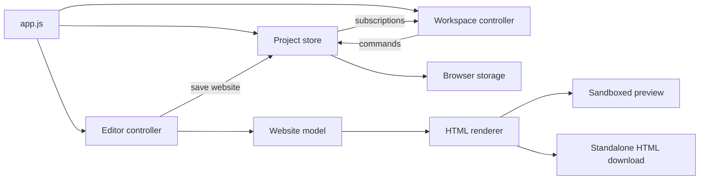

# Web Studio architecture

Web Studio is a browser-based workspace for managing website projects and editing single-page websites. The code is organized around those two capabilities. Each directory contains working code, rather than placeholders for services that do not exist yet.

## Source map

```text
src/
  app.js                          Application composition and startup
  features/
    projects/
      model.js                    Project records, seed data, filtering, validation
      store.js                    Project commands and state subscriptions
      card.js                     Project card DOM rendering
      workspace.js                Project list, forms, filters, backup interactions
    editor/
      templates.js                Named starting content and colors
      model.js                    Website normalization and field limits
      render.js                   Escaping and standalone HTML generation
      controller.js               Editor form, preview, save, export, device controls
  infrastructure/
    project-storage.js            Browser storage access and saved-data recovery
  shared/
    browser.js                    DOM lookup, downloads, status notifications
scripts/
  server.mjs                      Local static HTTP server
  build.mjs                       Static distribution assembly
  check.mjs                       Recursive JavaScript syntax checks
tests/                            Behavioral and architecture checks
docs/
  ARCHITECTURE.md                  Responsibilities, data flow, extension points
  REFERENCES.md                   Repository references and applied ideas
  decisions/                      Decisions and their tradeoffs
```

## Why these boundaries exist

| Part | Responsibility | Reason for the boundary |
| --- | --- | --- |
| Application entry | Construct one store and connect both features | Avoid separate project state in the workspace and editor |
| Project model | Validate records and query lists | Test rules without a browser or storage |
| Project store | Create, edit, toggle, delete, restore, save website | Give every interface action the same mutation path |
| Workspace controller | Bind DOM controls to project commands | Keep interaction details out of business rules |
| Project card | Render a record and emit user actions | Reuse the card without owning application state |
| Editor model | Normalize template selection, fields, colors | Apply identical constraints to saving and exporting |
| Templates | Provide starting data | Add templates without modifying editor event handlers |
| Renderer | Produce complete HTML from data | Use the same result for preview and exported files |
| Editor controller | Manage the open form and preview | Keep unsaved edits separate from stored project records |
| Storage adapter | Load saved records and handle unavailable browser storage | Provide a seam for a future repository implementation |
| Shared browser helpers | Download files and show status | Reuse browser mechanics without coupling feature behavior |
| Build/check scripts | Assemble artifacts and validate all modules | Keep a reproducible workflow as directories grow |

The store currently imports the local storage adapter to load and save snapshots. This is a deliberate small-application compromise: its storage object is injected and tests use an in-memory replacement. An asynchronous backend would require an explicit repository API and pending/error states; replacing `localStorage` alone would not be sufficient.

## Data flow



1. Startup loads valid saved projects or creates independent copies of the examples.
2. The workspace reads snapshots, filters them, and renders project cards.
3. Commands replace state, attempt persistence, and notify subscribers.
4. Opening the editor copies saved website values into a form. Typing updates the preview; saving updates the store.
5. Export runs the same renderer used by the preview, so page content does not diverge between the two paths.

## Data contracts

A project has `id`, `name`, `description`, `type`, `status`, `theme`, and `symbol`. A saved website is optional. Project names are limited to 60 characters and descriptions to 180; types and statuses use fixed allowed values. Project identifiers must be unique in imported workspaces.

Website data contains a template key, headline, tagline, description, button text, contact email, accent color, and background color. The model supplies missing defaults, limits text length, and accepts six-digit hexadecimal colors. The renderer escapes user text and uses a validated email address for contact links.

Exports use `{ version: 1, projects: [...] }`. Legacy array backups remain accepted. Local persistence retains the existing array format to preserve already saved workspaces. Unknown future backup versions must be rejected rather than silently interpreted as the current format.

## Operational choices

- ES modules run directly in the browser. No bundler or frontend runtime is required for this feature set.
- The build copies public source assets into `dist/`. This is distribution assembly, not minification or tree shaking.
- The server binds to localhost by default and exposes the entry page, source assets, and public assets. It is a development tool, not a production backend.
- Native dialogs supply modal behavior and keyboard focus. Controllers manage validation and user actions.
- Text nodes protect project cards from markup injection. The generated page uses HTML escaping, constrained colors, and a sandboxed preview.
- Node's test runner verifies model and store behavior. Browser interaction checks remain manual; the unit suite does not claim complete visual or accessibility coverage.

## Where new work belongs

**Another template:** add data to `features/editor/templates.js` and an option to the template select in `index.html`. Keep the same model fields unless the renderer is also extended.

**A new project action:** put its state transition in `features/projects/store.js`, add a behavioral test, then bind it in the workspace or card.

**Page sections:** introduce a serializable section model, a registry mapping section types to renderers, and tests for each renderer before adding block editing. Keep editor-only selection state out of the exported document.

**Accounts and shared projects:** add a backend and an asynchronous repository contract. Define ownership, authentication, conflict handling, and failure states before enabling shared writes.

**Publishing:** add a separate publishing service and track publish status. Preview/export should continue working independently of hosting availability.

**A larger interface:** consider a component framework when rendering complexity or repeated state synchronization justifies migration. The domain, normalization, and export modules can remain framework-independent.
